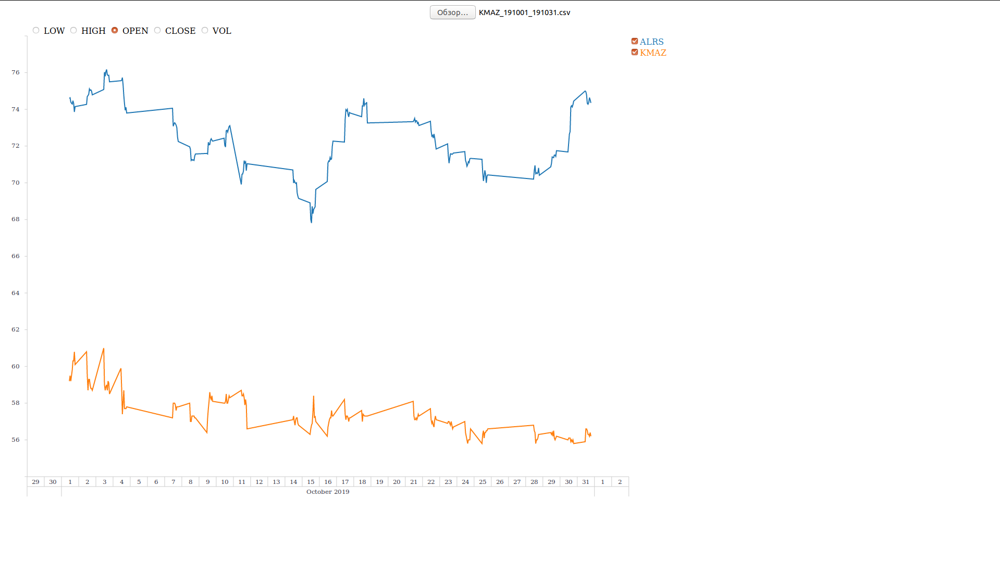

## StockApp: приложение для визуализации котировок акций

Исторические данные о котировках акций разных компаний содержатся в csv-файлах 
на локальных компьютерах пользователей приложения. Пользователь может добавлять 
несколько файлов с информацией о акциях. График визуализации будет доступен сразу 
же после загрузки файлов. При помощи данного графика есть возможность выявить 
зависимости как между котировками, так и от периода времени.

### Данные

csv-файлы с информацией о котировках содержит следующие столбцы:
- \<TICKER> -- Сокращенное название торгуемой акции
- \<PER> -- Периодичность показателей в минутах (например, 30, означает, что
            котировки снимаются каждые 30 минут)
- \<DATE> -- Дата снятия котировки в формате ггггммдд
- \<TIME> -- Время снятия котировки в формате ччммсс
- \<OPEN> -- Котировка на момент открытия биржи
- \<HIGH> -- Наивысшая котировка за прошедший интервал времени
- \<LOW> -- Минимальная котировка за прошедший интервал времени
- \<CLOSE> -- Котировка на момент закрытия биржи
- \<VOL> --  Суммарное количество проторгованных (купленных и проданных)
             акций за прошедший интервал времени

Скачать примеры таких csv-файлов можно либо в [папке samples](https://github.com/pashmentov96/StockApp/tree/master/samples),
либо на сайте [Финам](https://www.finam.ru/profile/moex-akcii/pllc-yandex-n-v/export/?market=1&em=388383&code=YNDX&apply=0&df=1&mf=6&yf=2019&from=01.07.2019&dt=8&mt=6&yt=2019&to=08.07.2019&p=6&f=YNDX_190701_190708&e=.csv&cn=YNDX&dtf=1&tmf=1&MSOR=1&mstime=on&mstimever=1&sep=3&sep2=2&datf=1&at=1&fsp=1).

### Пример

Пример работы данного приложения Вы можете увидеть на следующей картинке:
